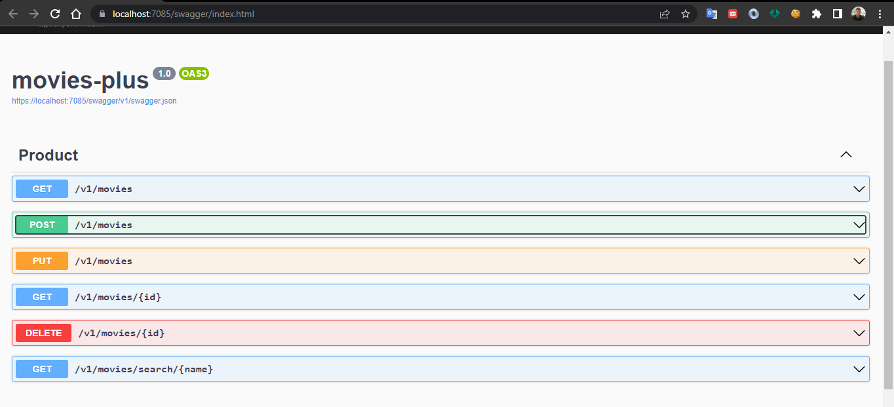

# movies-plus
Locatora de filmes

## Install
1. dotnet tool install --global dotnet-ef --version 6.0
2. Docker

## Settings project
1. dotnet 6.0.0
2. Mysql 8.0.30 

## Migrations
1. migration
```
dotnet ef migrations initMigration
```
2. updata database
```
dotnet ef database update
```

## Docker
```
docker-compose -f docker-compose.local.yml -f docker-compose-override.yml up -d
```

## Resultado do swaagger
